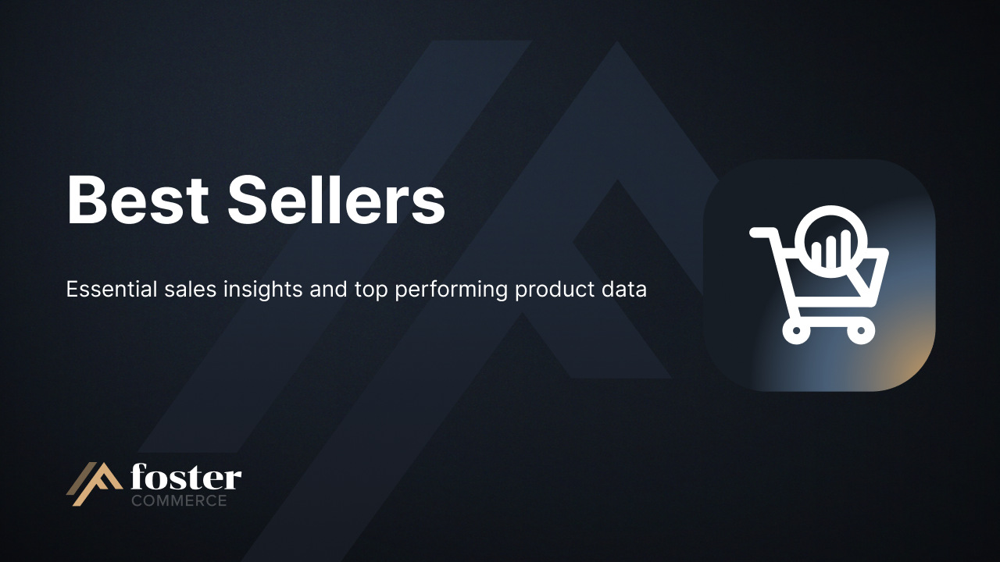
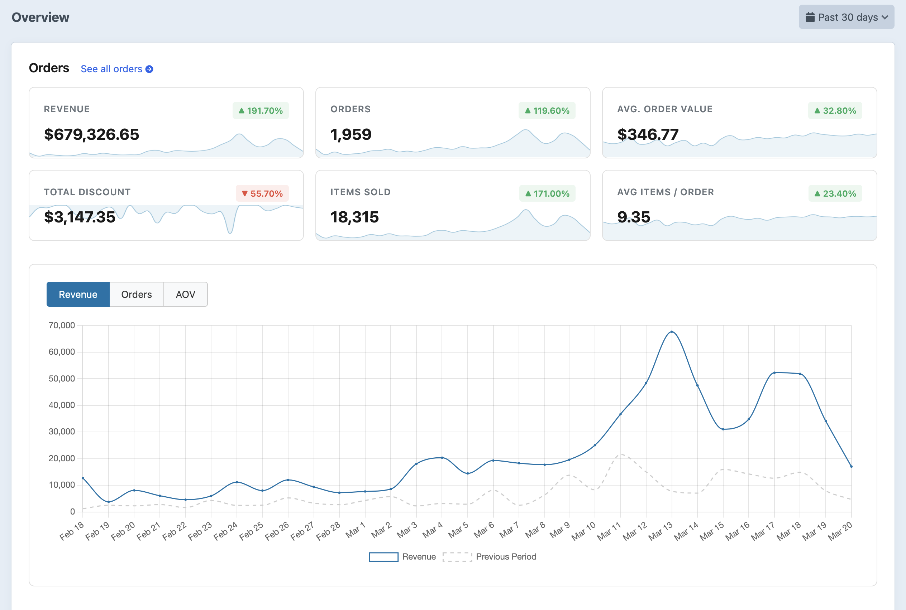
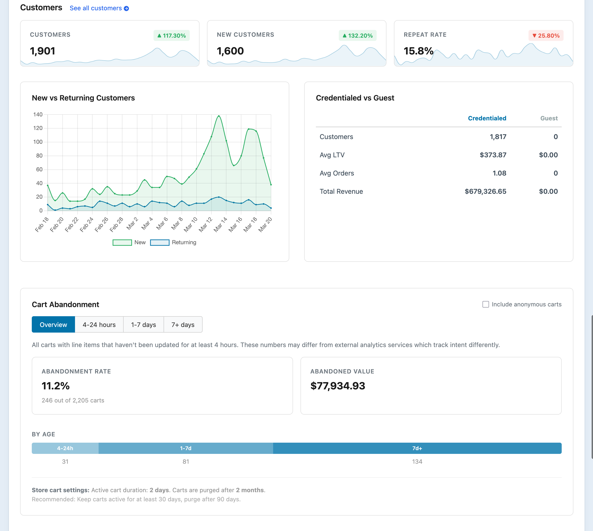
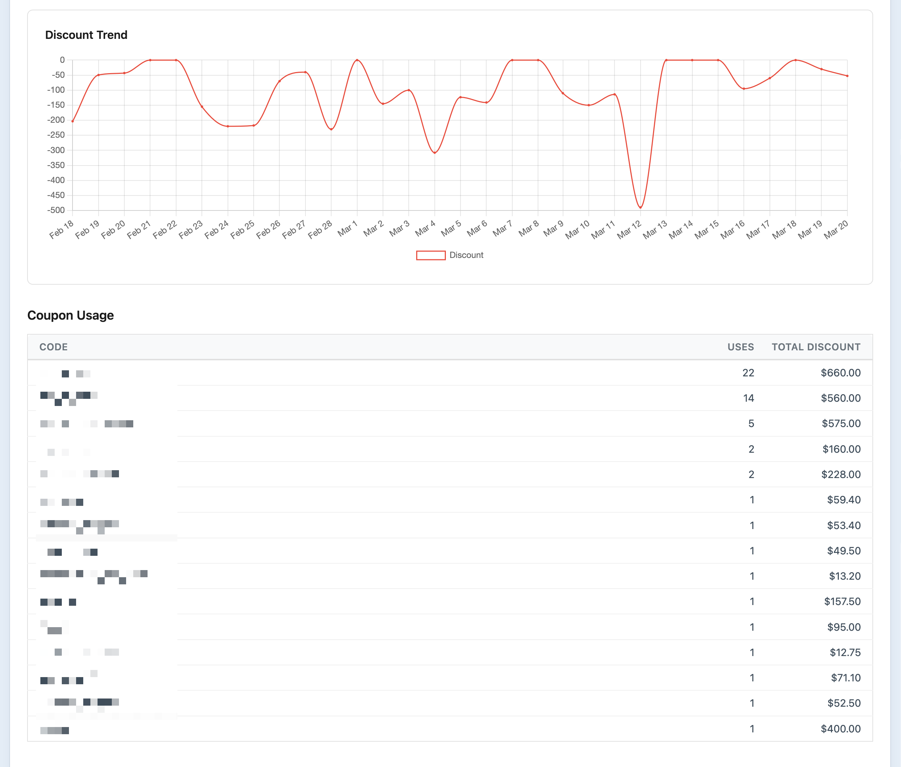

# Best Sellers for Craft Commerce

Sales analytics and reporting built for Craft Commerce. Track revenue, orders, products, and customers, all from your control panel.

Best Sellers gives you a clear picture of what's selling, who's buying, and how your store is performing over any date range. No external services, no data leaving your site.

## Requirements

This plugin requires Craft CMS 5.0.0 or later, Craft Commerce 5.0.0 or later, and PHP 8.2 or later.

## Installation

To install the plugin, follow these instructions.

1. Open your terminal and go to your Craft project:

        cd /path/to/project

2. Then tell Composer to load the plugin:

        composer require fostercommerce/commerce-best-sellers

3. In the Control Panel, go to Settings → Plugins and click the "Install" button for Best Sellers.

After installing, backfill your existing order data:

```bash
./craft best-sellers/backfill
./craft best-sellers/backfill/daily-stats
```

This processes your completed orders and builds the aggregated stats. New orders are tracked automatically going forward.

You can also run the backfill from the control panel under **Utilities > Best Sellers**.

## Features

### Overview Dashboard

The overview gives you a high-level snapshot of your store's performance for any date range:

- **KPI cards** for revenue, orders, AOV, items sold, discounts, customers, new customers, and repeat rate, each with sparkline trends and period-over-period change
- **Revenue, orders, and AOV charts** with previous period comparison
- **New vs returning customer** trends
- **Credentialed vs guest** customer breakdown with average LTV and order frequency
- **Cart abandonment** widget with age breakdown and anonymous cart tracking
- **Top 10 best sellers** with links to product edit pages





### Orders

Browse and search every completed order with filtering by order status, payment status, and keyword search.

- Sortable columns: order number, date, status, merchandise total, tax, discount, shipping, total paid, items sold, payment status
- Page totals for all currency columns
- **CSV export** with all applied filters


### Products

See which products (or variants) drive the most revenue, with breakdowns by product type.

- Toggle between **products and variants**
- Filter by product type
- Search by title, SKU, or product type
- Click through to see **every order containing a specific product**
- Sortable by units sold, order count, revenue, or average price
- **CSV export**


### Customers

Understand who your customers are, how much they spend, and how often they come back.

- Filter by customer type: credentialed or guest
- Search by email
- Sortable by email, status, order count, total spent, AOV, or last purchase date
- Links to customer profiles in the control panel
- **CSV export**


### Operations

Operational metrics to help you understand order patterns, shipping, and discount usage.

- **Items per order** distribution
- **Shipping methods** breakdown
- **Discount trend** over time
- **Coupon usage** with usage counts and total discount per code



### Date Range

All reports share a global date range picker with presets (today, this week, this month, past 7/30/90 days, past year, all time) or custom dates. The selected range is remembered across pages during your session. Every metric includes a comparison to the equivalent previous period.

## Templating

Best Sellers provides Twig variables for displaying sales data on your front end. Show bestseller badges, "X sold" counts, or sort products by popularity.

For full Twig and PHP usage examples, see the [Developer Documentation](docs/usage.md).

## Querying by Sales Data

Best Sellers extends Craft's element queries so you can fetch products or variants sorted by sales:

```twig
{# Top 10 best-selling products in the last 30 days #}

```

```php
use craft\commerce\elements\Product;

$bestSellers = Product::find()
    ->bestSellers('2024-01-01', '2024-12-31')
    ->limit(10)
    ->all();

foreach ($bestSellers as $product) {
    echo $product->title . ': ' . $product->totalQtySold;
}
```

## Console Commands

| Command | Description |
|---------|-------------|
| `./craft best-sellers/backfill` | Queue existing completed orders for processing (batches of 25) |
| `./craft best-sellers/backfill/daily-stats` | Rebuild the daily stats table from order data |

Both commands are also available from the **Utilities > Best Sellers** page in the control panel.

## Events

Best Sellers fires events that let you extend the reporting UI from other plugins or modules:

| Event | Description |
|-------|-------------|
| `RegisterReportPagesEvent` | Add custom pages to the report navigation |
| `RegisterKpiCardsEvent` | Add custom KPI cards to any report page |
| `ModifyReportDataEvent` | Modify report data before it renders |

## Credits

Brought to you by [Foster Commerce](https://fostercommerce.com)
